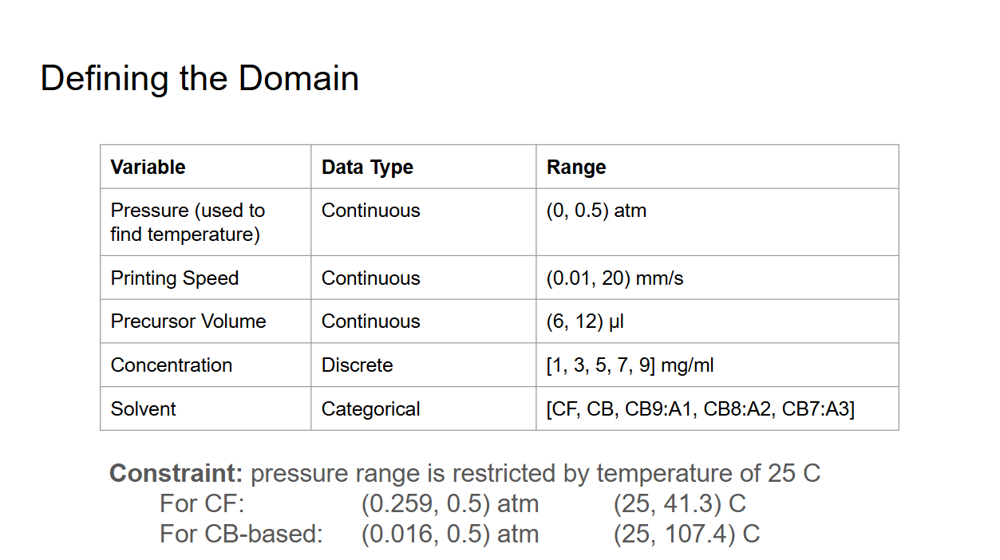
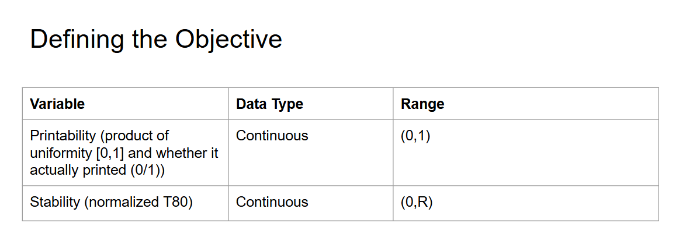

# Bayes Optimization Testing for Lab Automation
A coding space to test out different bayesian optimization frameworks and machine learning methods for the OPV lab automation project described here(https://github.com/changhwang/Lab_Automation/tree/master?tab=readme-ov-file#further-details).

## Description
Our mixed parameter space is [pressure, printing speed, precursor volume, concentration, and solvent], where concentration is discrete, solvent is categorical, and the rest are continuous. The objective we are maximizing is the dot product of a film's printability and stability. 

The concentration is encoded using the numbers [1,2,3,4,5] that are mapped to the actual concentrations through the mathematical transformation 2n-1.

The solvent CF stands for chloroform. The solvent CB stands for chlorobenzene. The CB:A solvents give a mixture of chlorobenzene and anisole along with their ratio. 

The domain is further constrained by the lowest temperature the hot plate can go, which is 25 degrees Celsius. This directly affects the pressure range that can be chosen in a specified solvent. The pressure (atm) is related to the temperature (Kelvin) through the Antoine equation of the specified solvent. 

## Getting Started
### Requirements
This package was developed using Python 3.10. 
The required packages are listed below.

- NumPy
- Matplotlib
- Pandas
- Scikit-Optimize
- Umap-learn
- Botorch

## Usage
The standalone files for testing bayesian optimization or machine learning consist of botorch_test.py, initial_gen_test.py, and scikit_test.py.
The rest of the files are meant to support the test files. However, the support files may have their own main class to run if 
there is something to change or test within them.

### botorch_test
You can directly run the file to perform a bayesian optimization loop on the old search space: Motor Speed, Temperature, Concentration, Print Gap, Volume. The only solvent optimized is CF. A dummy measurement is used.

Multiple problems occurred trying to use this framework, including incorporating the pressure/temperature constraint as well as categorical and discrete data. Due to a steep learning curve, this framework has been discarded in favor of scikit-optimize

### initial_gen_test
A program to determine the differences in the sampling methods LHS and Sobol. These depict what happens when you sample again on the same space and whether the new sampling points are spread out evenly from the older ones or not. This is to determine which sampling method to use if the given samples are problematic.

### scikit_test
You can directly run the file to perform a bayesian optimization loop on the current search space: Motor Speed, Pressure, Volume,
Concentration, and Solvent. A dummy measurement is used.

### benchmarks
Has a couple bayesian optimization benchmark tests as well as a dummy_measure test.

### constants
A small list of solvents and their Antoine equaton constants are defined within the file. The purpose of this is to make finding the temperature and pressure constraints per solvent easier. It is also used to easily convert pressure to temperature. There are also functions to find the interpolated graph of two different solvents.

You can run this file alone to get an example of how to use some of the code. 

### initial_point_generator
Generate initial points to test in the sample space. These are generated through sobol sampling. Previous sampling methods for discrete data are still contained within the file in case our sample space changes. To be used with bayesian optimization testing or other machine learning methods.

You can run this file alone to get an initial 30 points generated or points generated from a file. The code will use umap and pca reduction to plot the points on a graph to see the spread of the data within the total sample space.

### scikit_plot
A file with some functions to visualize data, including graphing 3d true objective, 4d data, pca, umap, optimization trace, and printing scikit-optimization results. This is utilized when visualizing initial sample space points and understanding scikit bayesian optimization results.

